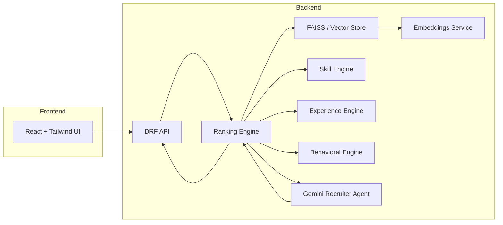

# Architecture Diagram

```mermaid
flowchart LR
  subgraph Frontend
    A[React + Tailwind UI]
  end
  subgraph Backend
    B[DRF API]
    C[Ranking Engine]
    D[Embeddings Service]
    E[FAISS / Vector Store]
    F[Skill Engine]
    G[Experience Engine]
    H[Behavioral Engine]
    I[Gemini Recruiter Agent]
  end
  A --> B
  B --> C
  C --> E
  E --> D
  C --> F
  C --> G
  C --> H
  C --> I
  I --> C
  C --> B
```