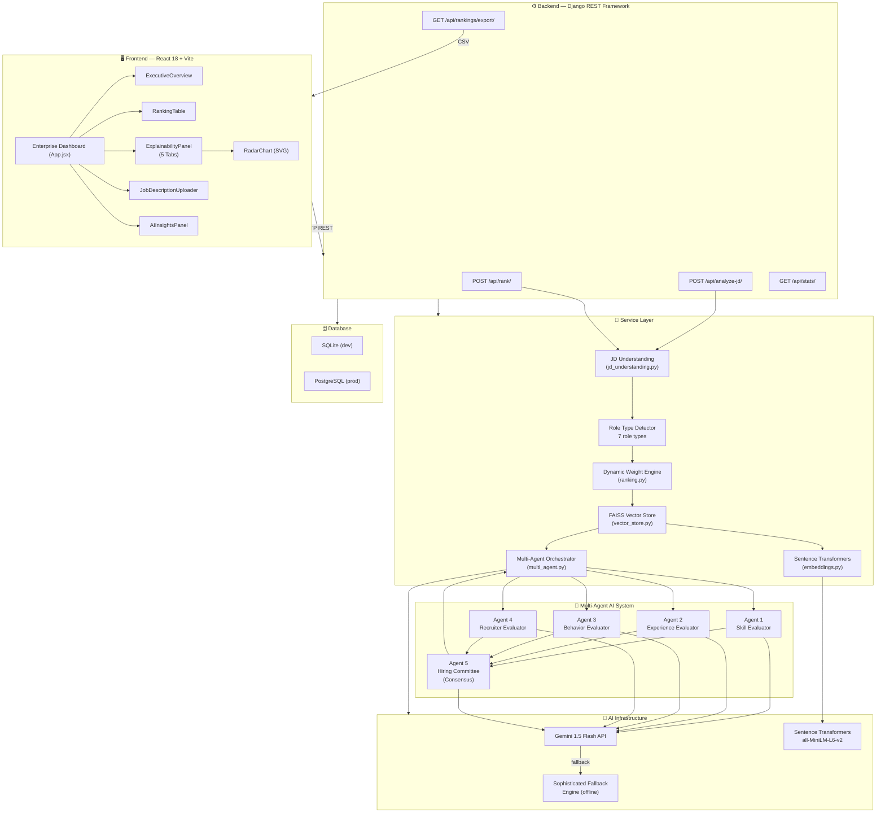
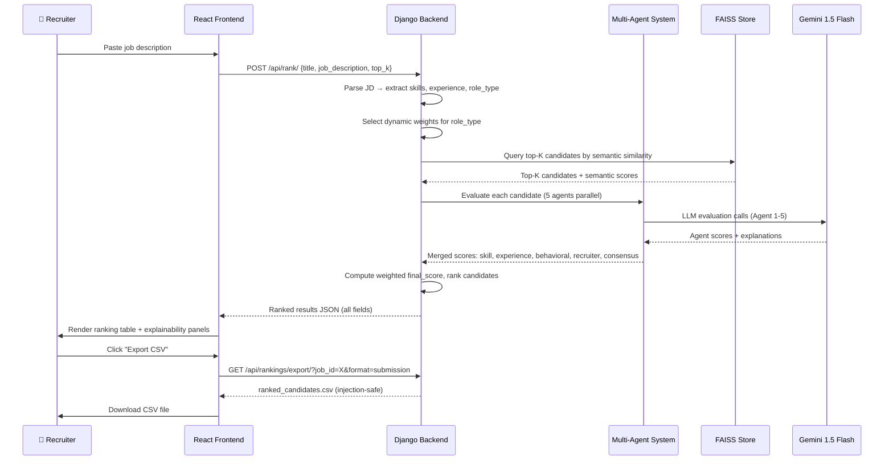
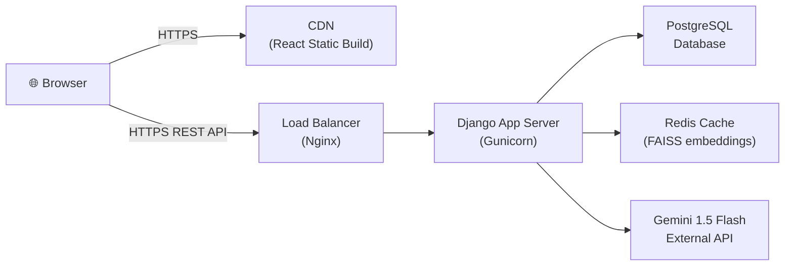

# 🏗️ HireGenius AI — System Architecture

**Beyond Keywords. Intelligent Hiring Starts Here.**

---

## 1. System Overview

HireGenius AI is a full-stack AI recruitment intelligence platform built on a multi-layered architecture. It combines semantic search, a 5-agent multi-agent AI evaluation system, and an enterprise React dashboard to deliver explainable, fair, and high-accuracy candidate rankings.

```
┌─────────────────────────────────────────────────────────────────────────┐
│                         HireGenius AI Platform                           │
├──────────────────────────────┬──────────────────────────────────────────┤
│   React Enterprise Dashboard  │        Django REST API Backend           │
│  ┌────────────────────────┐   │   ┌──────────────────────────────────┐  │
│  │ ExecutiveOverview       │   │   │ Job Description Analyzer          │  │
│  │ RankingTable            │   │   │ Role Type Detector               │  │
│  │ ExplainabilityPanel     │   │   │ Dynamic Weight Engine            │  │
│  │  ├ Overview Tab         │   │   │ FAISS Vector Store               │  │
│  │  ├ Scores Tab           │   │   │ Sentence Transformers Embeddings │  │
│  │  ├ Gap Analysis Tab     │   │   │ Multi-Agent Orchestrator         │  │
│  │  ├ Interview Tab        │   │   │ CSV Export (injection-safe)      │  │
│  │  └ Growth Tab           │   │   └──────────────────────────────────┘  │
│  │ RadarChart (SVG)        │   │                                         │
│  │ AIInsightsPanel         │   │   ┌──────────────────────────────────┐  │
│  └────────────────────────┘   │   │ SQLite (dev) / PostgreSQL (prod) │  │
│                                │   └──────────────────────────────────┘  │
├──────────────────────────────┴──────────────────────────────────────────┤
│                          Multi-Agent AI Layer                             │
│                                                                           │
│  Agent 1: Skill Evaluator    ──→  Matched/Missing/Learning Path          │
│  Agent 2: Experience Evaluator ─→  Career Trajectory / Growth Forecast   │
│  Agent 3: Behavior Evaluator ──→  Culture Fit / Risk / Engagement        │
│  Agent 4: Recruiter Evaluator ─→  Salary Fit / Time-to-Hire Signals      │
│  Agent 5: Hiring Committee   ──→  Consensus / Confidence / Potential     │
├─────────────────────────────────────────────────────────────────────────┤
│               AI Infrastructure Layer                                     │
│   FAISS Vector Store  │  Sentence Transformers  │  Gemini 1.5 Flash API  │
│   (Semantic Search)   │  (all-MiniLM-L6-v2)    │  (+ Robust Fallback)   │
└─────────────────────────────────────────────────────────────────────────┘
```

---

## 2. Full Mermaid Architecture Diagram



---

## 3. AI Pipeline — Step by Step

```
Step 1: JOB DESCRIPTION INPUT
  └─ Recruiter pastes a job description in the dashboard

Step 2: JD UNDERSTANDING ENGINE
  └─ Extracts: required_skills, preferred_skills, years_experience,
               seniority_level, behavioral_traits, industry_focus

Step 3: ROLE TYPE DETECTION
  └─ Semantic classification → one of 7 role types:
     backend | frontend | leadership | research | data | design | general

Step 4: DYNAMIC WEIGHT SELECTION
  └─ Looks up role-specific weight table:
     e.g., Research → {semantic: 0.40, skill: 0.20, experience: 0.15,
                        recruitability: 0.10, llm: 0.15}

Step 5: FAISS SEMANTIC SEARCH
  └─ Encodes JD with Sentence Transformers
  └─ Queries FAISS index → Top-K candidate vectors returned
  └─ Semantic similarity score computed for each candidate

Step 6: MULTI-AGENT EVALUATION (Parallel)
  ├─ Agent 1: Skill Evaluator
  │   └─ Computes: skill_score, matched_skills, missing_skills, learning_path
  ├─ Agent 2: Experience Evaluator
  │   └─ Computes: experience_score, career_trajectory, growth_forecast
  ├─ Agent 3: Behavior Evaluator
  │   └─ Computes: behavioral_score, risk_level, culture_fit_signals
  ├─ Agent 4: Recruiter Evaluator
  │   └─ Computes: recruitability_score, salary_fit, time_to_hire_estimate
  └─ Agent 5: Hiring Committee (Consensus)
      └─ Computes: final_score, confidence_score, potential_score,
                   recommendation, strengths, weaknesses, recruiter_summary

Step 7: WEIGHTED FINAL SCORE
  └─ final_score = Σ(weight_i × score_i) for all 5 dimensions

Step 8: EXPLAINABLE OUTPUT
  └─ Returns ranked list with per-candidate:
     rank, final_score, recommendation, potential_score, confidence_score,
     risk_level, strengths, weaknesses, missing_skills, learning_path,
     interview_questions, growth_forecast, salary_fit, recruiter_summary
```

---

## 4. Component Architecture

### 4.1 Backend Services

| Service File | Responsibility |
|-------------|---------------|
| `jd_understanding.py` | Parse job descriptions; extract skills, experience, seniority, behavioral traits |
| `ranking.py` | Core ranking engine; dynamic weight selection; final score computation |
| `multi_agent.py` | Orchestrate 5 specialized AI agents; collect and merge scores |
| `embeddings.py` | Generate Sentence Transformer embeddings; fallback TF-IDF encoder |
| `vector_store.py` | FAISS index management; add candidates; semantic search queries |
| `skill_engine.py` | Skill matching, gap analysis, learning path generation |
| `experience_engine.py` | Career trajectory scoring; years of experience validation |
| `behavioral_engine.py` | GitHub activity signals; recruitability scoring; culture fit |

### 4.2 Frontend Components

| Component | Responsibility |
|-----------|---------------|
| `App.jsx` | Main layout; sidebar navigation; view switching (Overview / Rank / Insights) |
| `ExecutiveOverview.jsx` | KPI cards; top candidate spotlight; distribution charts; hiring funnel |
| `RankingTable.jsx` | Enterprise candidate table; rank badges; score bars; risk indicators |
| `ExplainabilityPanel.jsx` | 5-tab per-candidate deep-dive panel (Overview, Scores, Gap, Interview, Growth) |
| `RadarChart.jsx` | Zero-dependency SVG radar chart for candidate vs. job comparison |
| `ScoreBreakdownChart.jsx` | Animated multi-dimension score breakdown bars |
| `JobDescriptionUploader.jsx` | JD textarea; example templates; AI analysis trigger |
| `AIInsightsPanel.jsx` | Market intelligence; skill trends; hiring recommendations |

### 4.3 Database Models

| Model | Key Fields |
|-------|-----------|
| `Candidate` | id, full_name, email, skills, experience_years, github_url, resume_text |
| `Job` | id, title, description, role_type, required_skills, created_at |
| `RankingJob` | id, job (FK), created_at, weights_used |
| `RankingResult` | id, ranking_job (FK), candidate (FK), rank, all score fields, explanation fields |

---

## 5. Data Flow Diagram



---

## 6. Security Architecture

```
Input Validation Layer
  └─ Max 20,000 chars for job description inputs
  └─ Top-K capped at 50 (resource exhaustion prevention)
  └─ All string fields validated before DB write

Authentication Layer (Demo)
  └─ Open API for hackathon demo
  └─ Production: JWT / API key middleware (pluggable)

Secret Management
  └─ GEMINI_API_KEY loaded from OS environment only
  └─ DJANGO_SECRET_KEY enforced via env var warning
  └─ No secrets in source code or logs

CORS Policy
  └─ CORS_ALLOWED_ORIGINS set via env var
  └─ Defaults to localhost only in dev mode
  └─ Production: restrict to frontend domain

CSV Export Security
  └─ Injection prevention: cells starting with =, +, -, @ prefixed with '
  └─ All fields treated as string literals in CSV output
  └─ Content-Disposition header set for file download
```

---

## 7. Deployment Architecture (Production)



---

*HireGenius AI — Beyond Keywords. Intelligent Hiring Starts Here. ⚡*